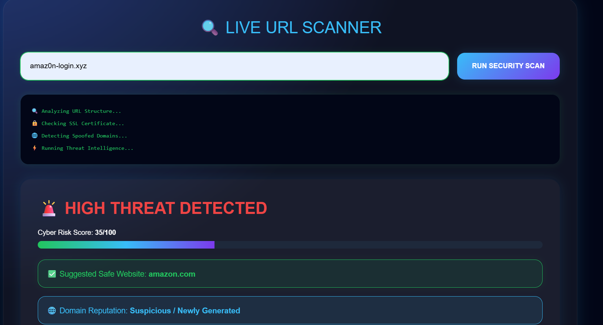
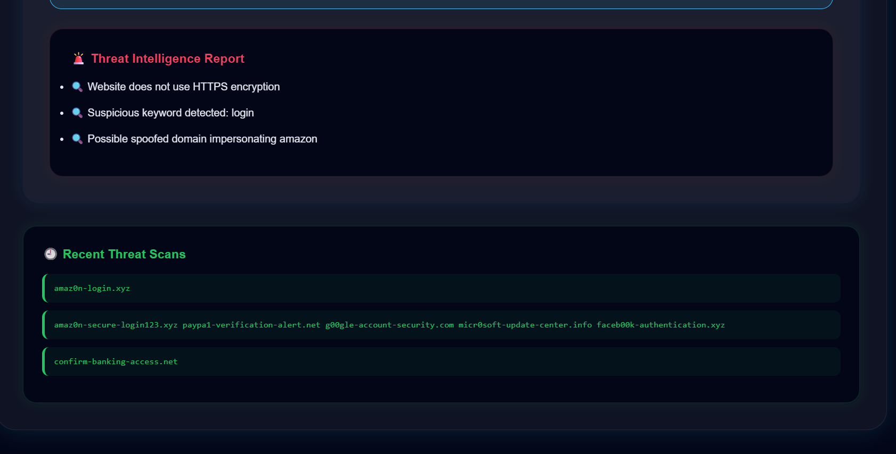

# DATA DEFENDERS 🛡️
### Smart Links. Safe Clicks.

DATA DEFENDERS is a cybersecurity-focused phishing URL detection platform designed to help users identify suspicious and malicious links before interacting with them. The system analyzes URLs using threat intelligence logic, spoof detection, keyword analysis, trust scoring, and reputation analysis to improve cyber awareness and digital safety.

## 🚀 Features

- HTTPS Verification
- Spoofed Domain Detection
- IP Address Detection
- Cyber Risk Score
- Programmer URL Suggestions
- Domain Reputation Analysis
- Recent Threat Scan History
- Interactive Cybersecurity Dashboard
- Input Validation & Error Handling
  
## 🛠️ Tech Stack

- Python
- Flask
- HTML
- CSS
- Regular Expressions (Regex)

## 📸 Screenshots

### Homepage


### Scanner Page


### Tips Page


### Detection Result



## 👥 Team Members

- Nida Fathima
- Soha Mohammad maqsood
- Ramsha Yasmeen

## UN Sustainable Development Goals

This project aligns with:

- SDG 9: Industry, Innovation and Infrastructure
- SDG 16: Peace, Justice and Strong Institutions

 ## Future Enhancements

- AI-powered phishing prediction
- Browser extension support
- Live cybersecurity threat APIs
- Advanced URL reputation systems
- User authentication and scan logs

# Installation Guide

```bash
git clone https://github.com/nida1411/DATA-DEFENDERS

cd DATA-DEFENDERS

pip install flask

python app.py
```


## ⚡ Purpose

The goal of DATA DEFENDERS is to spread cyber awareness and help users avoid phishing attacks and malicious links.
