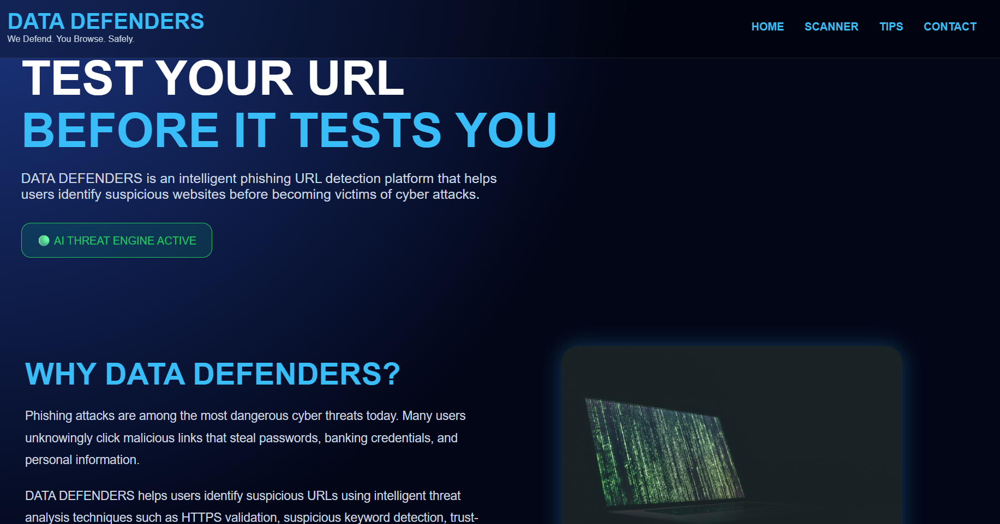
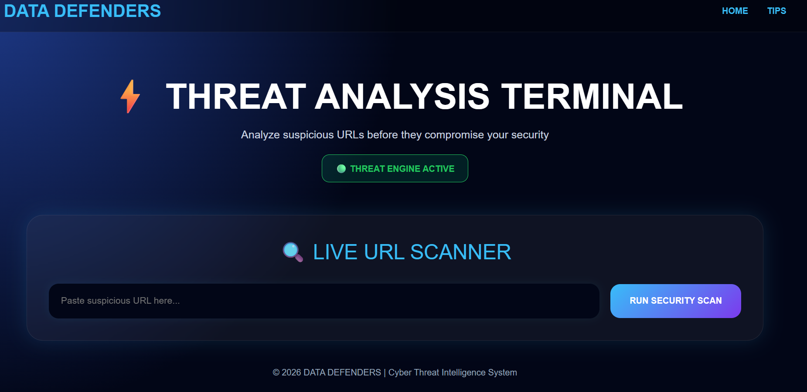
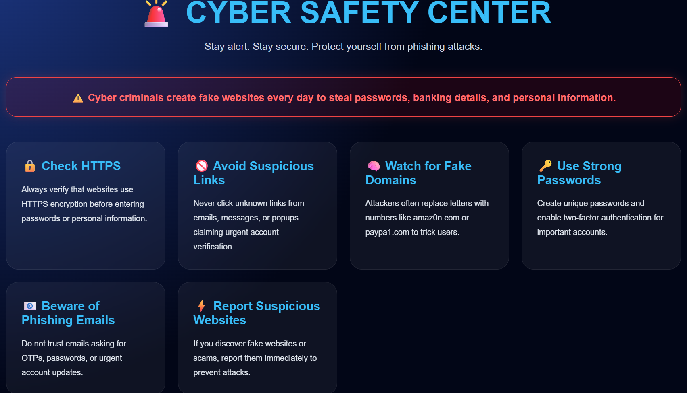
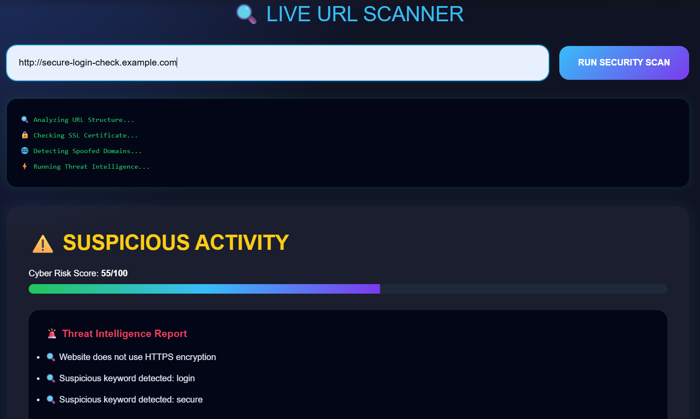

# DATA DEFENDERS 🛡️

A phishing URL detection platform designed to identify suspicious and malicious websites using cybersecurity threat analysis techniques.

## 🚀 Features

- Phishing URL Detection
- HTTPS Verification
- Suspicious Keyword Analysis
- Spoofed Domain Detection
- Trust Score System
- Interactive Cybersecurity UI
- Error Handling & Validation

## 🛠️ Tech Stack

- Python
- Flask
- HTML
- CSS

## 📸 Screenshots

### Homepage

### Scanner Page

### Tips Page

### Detection Result

## 👥 Team Members

- Nida Fathima
- Soha Mohammad maqsood
- Ramsha Yasmeen

## ⚡ Purpose

The goal of DATA DEFENDERS is to spread cyber awareness and help users avoid phishing attacks and malicious links.
